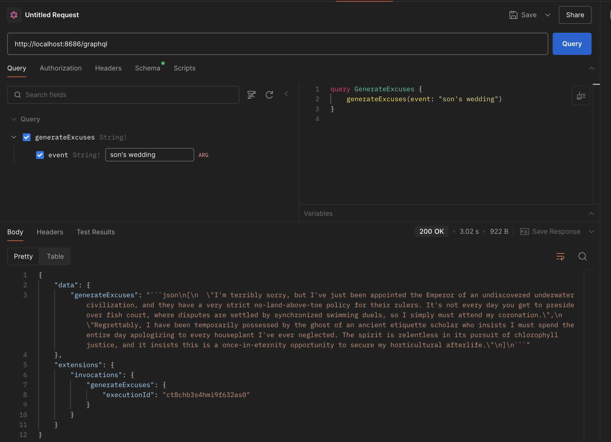

## Introduction

Before diving into Modus and Hypermode, let's explore the problems this platform aims to solve. According to their GitHub repository:

> Modus: an open source, serverless framework for building model-native apps, powered by WebAssembly

A brief look at their documentation reveals two key differentiators from traditional backend frameworks:

1. **WebAssembly-First Architecture**
   Where most backend frameworks use Node.js, Go, Python, and Rust, Modus takes a different approach by leveraging WebAssembly as its foundation. This architectural choice brings unique advantages in security, performance, and developer experience, which we'll explore in detail.

2. **Model-Native Development**
   The term "model-native" draws inspiration from "cloud-native" applications, though they solve different problems. While cloud-native apps revolutionized how we build and deploy software by integrating cloud principles, model-native apps aim to transform how we develop intelligent APIs by treating AI/ML models as first-class citizens in the development process.

What makes Modus particularly interesting isn't necessarily the invention of new concepts, but rather its novel combination of existing technologies: WebAssembly for computation, GraphQL for API design, and AI/ML models as core building blocks. This approach could enable a new paradigm in software architecture – one where AI capabilities are deeply woven into the application's fabric rather than added as an afterthought.

### A Concrete Example: Model-Native Development in Action

Let's look at a simple yet illustrative example of what model-native development looks like with Modus. Here's a function that generates creative excuses using OpenAI's chat model:

```typescript
import { models } from "@hypermode/modus-sdk-as";
import {
  OpenAIChatModel,
  SystemMessage,
  UserMessage,
} from "@hypermode/modus-sdk-as/models/openai/chat";

export function generateExcuses(event: string): string {
  const model = models.getModel<OpenAIChatModel>("llm");

  const input = model.createInput([
    new SystemMessage(
      "You are a creative, dark and sarcastic excuse generator."
    ),
    new UserMessage(`Generate 2 absurd excuses for why I can't attend "${event}".`),
  ]);

  input.temperature = 0.9;  // Increase creativity
  const response = model.invoke(input);
  return response.choices[0].message.content;
}
```

This simple example demonstrates several key aspects of model-native development:

1. **Native Model Integration**: The AI model is a first-class citizen, accessed through type-safe SDK interfaces rather than raw API calls.
2. **Type Safety**: The entire interaction with the model is type-safe, from input creation to response handling.
3. **Developer Experience**: No manual JSON handling, API key management, or response parsing needed.
4. **WebAssembly Benefits**: This code runs in a secure sandbox with near-native performance.

What's particularly noteworthy is how the model interaction feels natural and integrated – just like working with any other component of your application. This is the essence of model-native development.

Here's what the GraphQL query response looks like:



## Why Modus?

While many modern backend frameworks already offer excellent developer experience with features like code generation, type safety, and reducing boilerplate configurations and code, Modus takes a unique approach by combining these familiar benefits with some distinctive twists of it own:

1. **WebAssembly-First Runtime**
   Unlike traditional backend frameworks that execute code directly on the host system, Modus leverages WebAssembly to create a secure, high-performance runtime environment. This isn't just a technical choice – it fundamentally changes how we think about backend service architecture:
   - Secure by default: Each function runs in its own sandboxed environment
   - Predictable performance: Near-native speed without the cold-start penalties of containers
   - Language flexibility: Write services in Go or AssemblyScript, with consistent runtime characteristics

2. **True Model-Native Design**
   While other frameworks treat AI/ML integration as an add-on feature, Modus makes it a core architectural concern:
   - Direct model integration: Connect to AI services (like OpenAI, Anthropic) with type-safe interfaces
   - Unified schema: Models, data, and services share a single GraphQL schema
   - Optimized for AI workflows: Built-in support for streaming responses and model-specific types

3. **Developer Experience First**
   Modus combines the best practices from modern backend development with innovations specific to AI/ML workloads:
   - Automatic GraphQL schema generation from your function signatures
   - Type safety across your entire stack – from AI models to API endpoints
   - Hot reloading that works with both traditional code and AI model integrations

Let's dive deeper into these aspects and see how they complement existing backend development practices.

### WebAssembly-First: A New Paradigm for Backend Services

While WebAssembly (Wasm) is traditionally associated with browser-based applications, Modus leverages it as a foundational technology for backend services. This unconventional choice brings several compelling advantages:

#### Security Through Isolation

Traditional backend frameworks execute code directly on the host system, requiring careful consideration of security boundaries. Modus's WebAssembly runtime (powered by Wazero) provides inherent security benefits:

- **Sandboxed Execution**: Each function runs in its own isolated environment, preventing unauthorized access to system resources
- **Memory Safety**: WebAssembly's linear memory model eliminates entire classes of memory-related vulnerabilities
- **Controlled System Access**: Functions can only access resources explicitly granted by the runtime

#### Cross-Language Compatibility

Unlike frameworks that are tied to specific programming languages, Modus's WebAssembly approach enables a form of polyglot development (though perhaps not truly polyglot):

- Write functions in any language that compiles to WebAssembly (Go, Rust, AssemblyScript, etc.)
- Maintain consistent performance characteristics across language choices
- Share types and interfaces between different language implementations

#### Performance Characteristics

WebAssembly's near-native performance makes it a viable alternative to traditional backend runtimes:

- **Quick Cold Starts**: WebAssembly modules initialize faster than traditional containerized services
- **Efficient Resource Usage**: Small memory footprint and fast execution make it ideal for serverless environments
- **Predictable Performance**: Consistent execution times due to ahead-of-time compilation

#### Language Choice: A Strategic Decision

While Modus supports both Go and AssemblyScript, the inclusion of AssemblyScript as a first-class language deserves particular attention. The claim that "AssemblyScript is ideal for web developers getting started with WebAssembly" reflects both strategic advantages and practical considerations:

**Web Developer Advantages:**
- TypeScript-like syntax provides immediate familiarity
- Similar tooling and development patterns to frontend work
- Natural progression for JavaScript/TypeScript developers

**Technical Benefits:**
- Purpose-built for WebAssembly, unlike Go which requires TinyGo compilation
- Optimized for web-centric use cases
- Simpler mental model for web developers

However, this choice also comes with trade-offs:
- Smaller ecosystem compared to Go
- Fewer libraries and tools available
- Still evolving language features
- May not be optimal for all backend computing scenarios

By supporting both AssemblyScript and Go, Modus offers teams flexibility in their approach:
- Frontend teams can leverage their TypeScript expertise with AssemblyScript
- Backend teams can utilize their existing Go knowledge
- Projects can mix languages based on specific microservice requirements

This dual-language strategy reflects a pragmatic approach to WebAssembly adoption, acknowledging that different teams have different starting points in their WebAssembly journey.

#### Trade-offs and Considerations

While WebAssembly brings many advantages, it's essential to understand the trade-offs:

- **Ecosystem Maturity**: The WebAssembly ecosystem for backend services is still evolving
- **Development Workflow**: Requires compilation to WebAssembly as an additional build step
- **Language Support**: Not all programming languages have mature WebAssembly support

Despite these considerations, Modus's WebAssembly-first approach enables a unique combination of security, performance, and language flexibility that's particularly well suited for building modern,secure, and efficient backend services.

## The Hypermode Connection

Modus is developed by Hypermode Inc. as an open-source project, maintaining a careful balance between community-driven development and commercial support. While Modus itself is fully open-source, Hypermode provides a commercial hosting platform optimized for running Modus applications. This relationship mirrors other successful open-source projects like HashiCorp's Terraform or MongoDB, where the core technology is open-source while offering enterprise-grade hosting and support options.

The Hypermode platform adds features you'd expect from a commercial offering:
- Managed hosting optimized for Modus applications
- Enterprise support and SLAs
- Advanced monitoring and telemetry
- High availability configurations

However, Modus remains fully functional as a standalone framework, whether you're running it locally or deploying to your own infrastructure.

## Conclusion: The Road Ahead

In this first part of our exploration of Modus, we've covered the fundamental concepts that make it a unique addition to the modern backend development landscape:

- **WebAssembly-First Architecture**: A strategic choice that provides security, performance, and language flexibility
- **Model-Native Development**: A fresh approach to integrating AI/ML capabilities as first-class citizens
- **Developer Experience**: Thoughtful abstractions that reduce complexity without sacrificing control
- **Language Strategy**: Pragmatic support for both Go and AssemblyScript, catering to different developer backgrounds

But we've only scratched the surface. In Part 2, we'll dive deeper into:

1. **Building Real Applications**
   - Setting up a Modus development environment
   - Creating and deploying your first model-native app
   - Best practices for production deployments

2. **Advanced Features**
   - Working with multiple AI models
   - Custom model integrations
   - Performance optimization techniques
   - Advanced GraphQL schema designs

3. **Production Considerations**
   - Scaling strategies
   - Monitoring and observability
   - Security best practices
   - Cost optimization

Stay tuned as we move from concepts to concrete implementation, showing you how to leverage Modus's unique capabilities in real-world applications.
